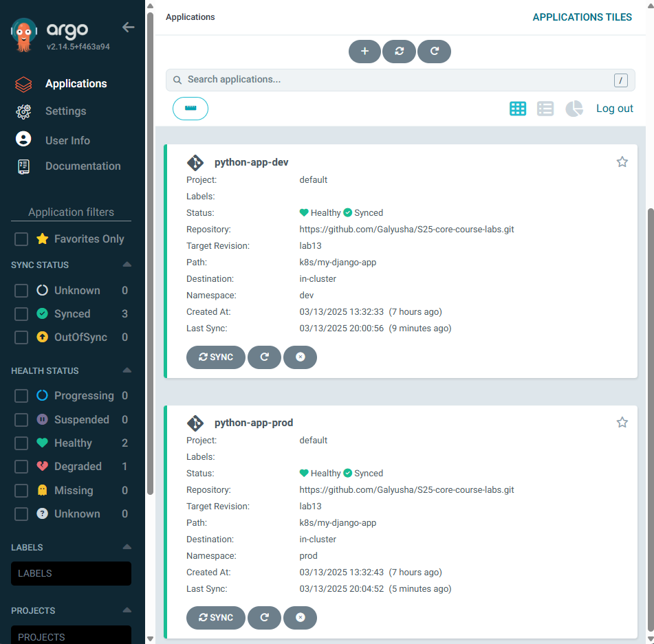
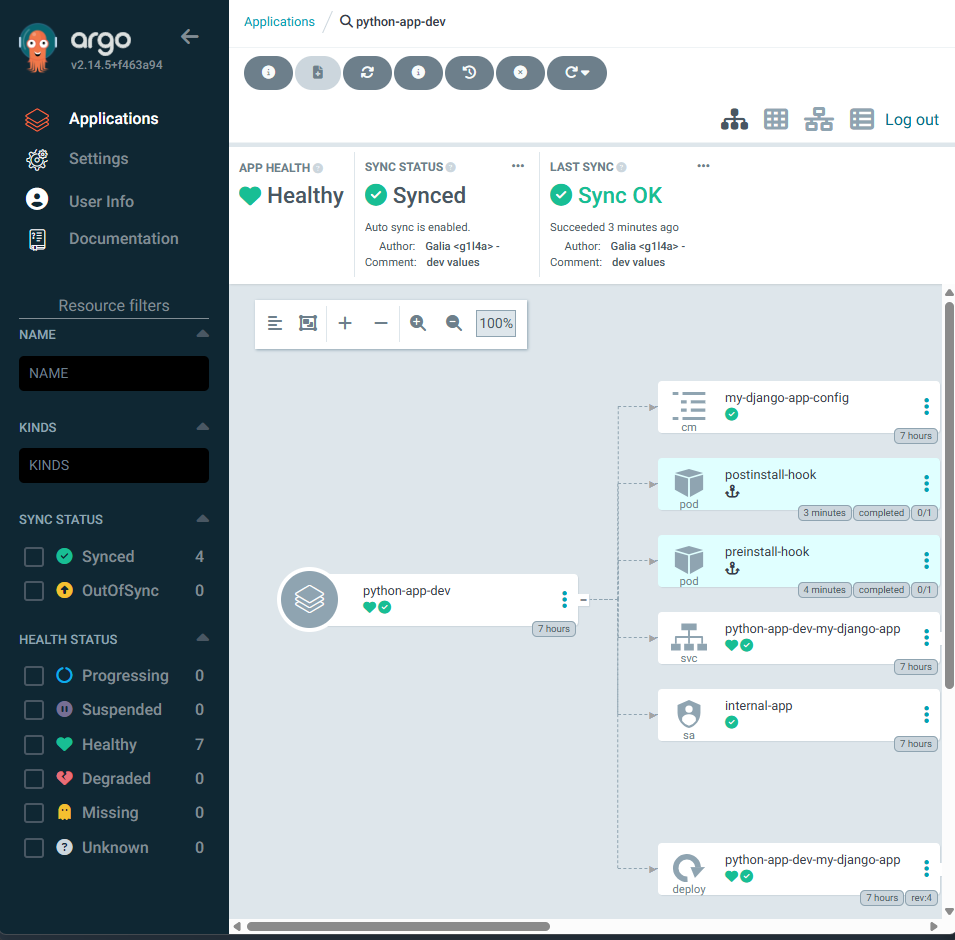
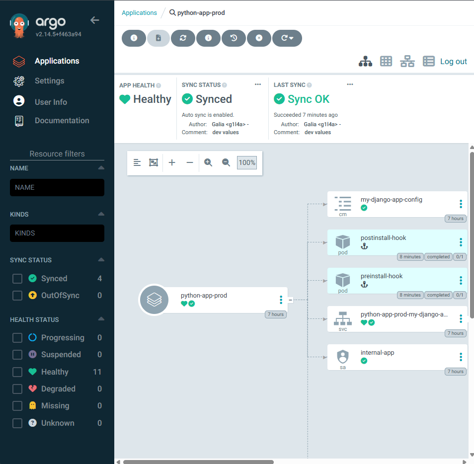
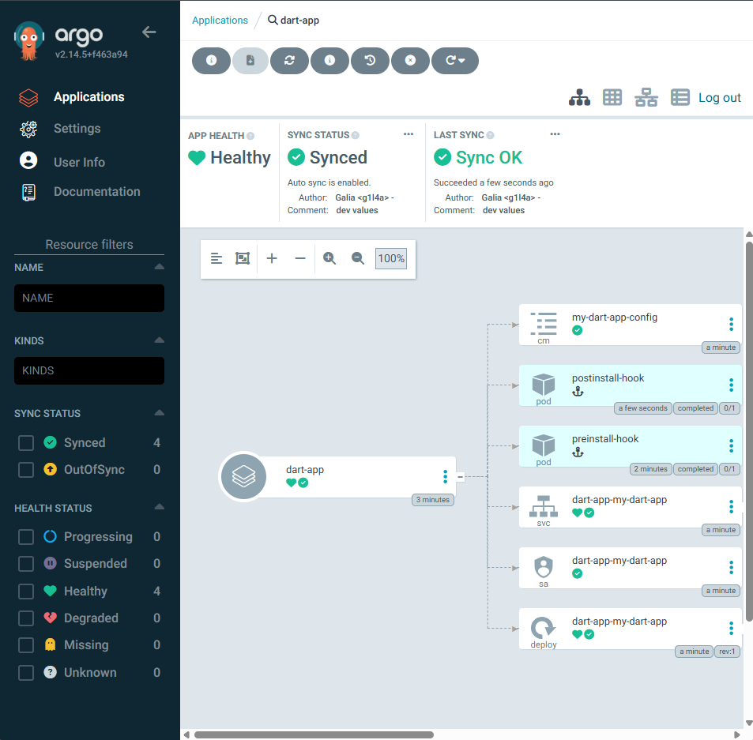

# Lab 13: ArgoCD for GitOps Deployment
## Task 1: Deploy and Configure ArgoCD

### Log in
```bash
kubectl -n argocd get secret argocd-initial-admin-secret -o jsonpath="{.data.password}" | ForEach-Object { [System.Text.Encoding]::UTF8.GetString([System.Convert]::FromBase64String($_)) }

argocd login localhost:8080 --username admin --password 

kubectl port-forward service/argo-argocd-server -n argocd 8080:443
```

## Task 2: Multi-Environment Deployment & Auto-Sync

### Output of pods before and after pod deletion

```bash
PS D:\S25-core-course-labs\k8s> kubectl get pods -n prod -w
NAME                                            READY   STATUS      RESTARTS   AGE
postinstall-hook                                0/1     Completed   0          4m14s
preinstall-hook                                 0/1     Completed   0          4m42s
python-app-prod-my-django-app-9cf6d894c-2mxlb   1/1     Running     0          24m 
python-app-prod-my-django-app-9cf6d894c-5n6hm   1/1     Running     0          18m 
python-app-prod-my-django-app-9cf6d894c-vqtjw   1/1     Running     0          18m 
PS D:\S25-core-course-labs\k8s> kubectl delete pod -n prod -l app.kubernetes.io/name=my-django-app
pod "python-app-prod-my-django-app-9cf6d894c-2mxlb" deleted
pod "python-app-prod-my-django-app-9cf6d894c-5n6hm" deleted
pod "python-app-prod-my-django-app-9cf6d894c-vqtjw" deleted
PS D:\S25-core-course-labs\k8s> kubectl get pods -n prod -w
NAME                                            READY   STATUS      RESTARTS   AGE
postinstall-hook                                0/1     Completed   0          7m33s
preinstall-hook                                 0/1     Completed   0          8m1s
python-app-prod-my-django-app-9cf6d894c-5pwdn   1/1     Running     0          41s 
python-app-prod-my-django-app-9cf6d894c-r5gxd   1/1     Running     0          41s 
python-app-prod-my-django-app-9cf6d894c-tspwk   1/1     Running     0          41s 
```

### Test 1



### Test 2





### How ArgoCD Handles Configuration Drift vs. Runtime Events

- **Configuration Drift:**
  ArgoCD detects and reverts manual changes to resources (e.g., replica count) to match the desired state defined in Git. For example, if you manually scale a deployment, ArgoCD will revert it to the state defined in the Git repository.

- **Runtime Events:**
  ArgoCD does not interfere with runtime events (e.g., pod deletions) as Kubernetes handles these automatically to maintain the desired state. For example, if a pod is deleted, Kubernetes will recreate it to match the replica count defined in the deployment, and ArgoCD will not consider this as configuration drift.

## Bonus Task: Sync Your Bonus App with ArgoCD



```bash
PS D:\S25-core-course-labs\k8s> kubectl get pods -n default
NAME                                    READY   STATUS                       RESTARTS   AGE
dart-app-my-dart-app-777d76b88f-62xqs   1/1     Running                      0          2m30s
postinstall-hook                        0/1     Completed                    0          2m5s
preinstall-hook                         0/1     Completed                    0          2m55s
```